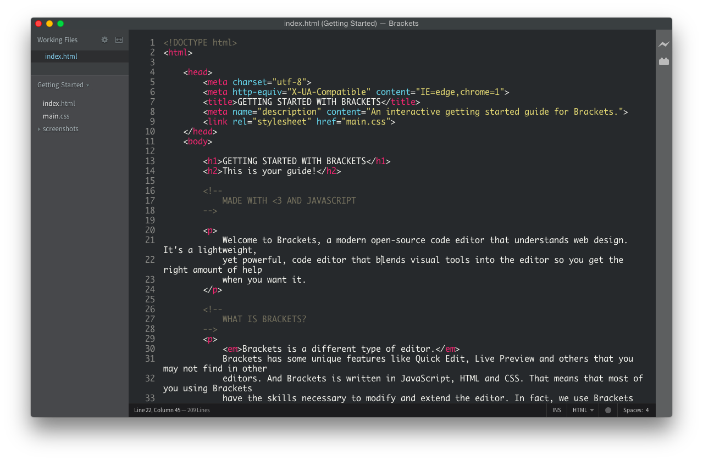
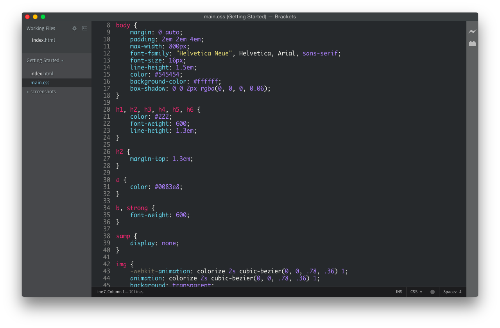
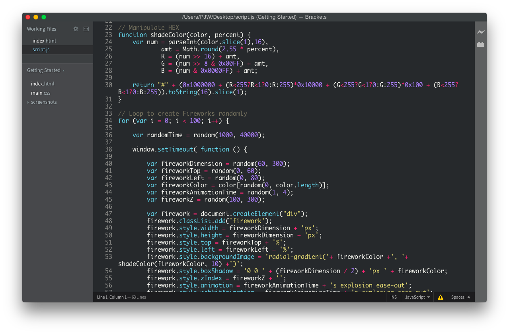

Brackets Theme: SoftDark
========================

This theme is a improved version of [Sublime Text](http://sublimetext.com/)'s default theme for Brackets.

Screenshots
-----------

### HTML

### CSS

### JavaScript

Installation
------------

This extension requires Brackets Release 1.0 or newer.

### Install from Brackets Theme List
1. Open Brackets
2. Open the Extension Manager
3. Switch to "Themes" tab
4. Search for "SoftDark"
5. Click "Install"

### Install from Github Repository
1. Open Brackets
2. Open the Extension Manager
3. Switch to "Themes" tab
4. Click "Install from URL"
5. Use "https://github.com/prettyxw/Brackets-Theme-SoftDark"
6. Click "Install"

### Install from Package File
1. Go to "releases"
2. Download the latest package
3. Open Brackets
4. Open the Extension Manager
5. Switch to "Themes" tab
6. Drag zip package to the lower left conner

License
-------

The GPL License. Read [GNU General Public License](http://www.gnu.org/licenses/gpl.html) for further information.